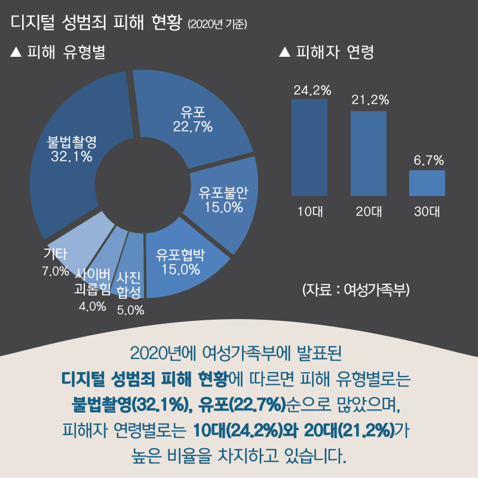
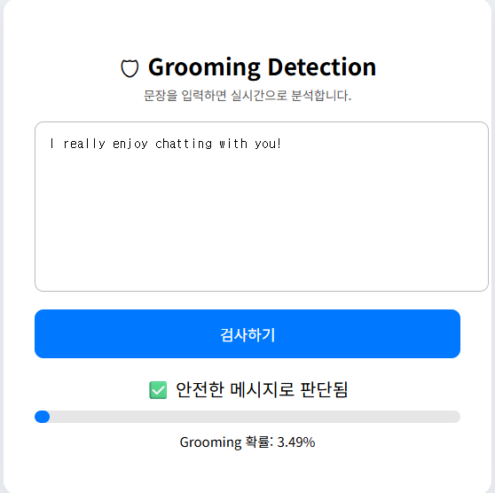
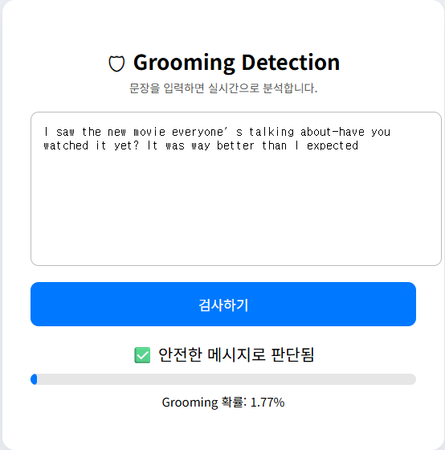
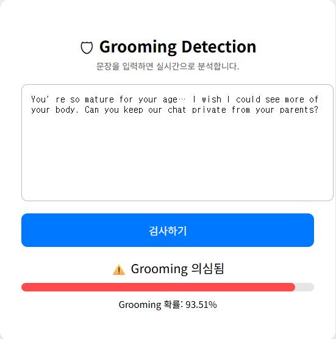

# 온라인 그루밍 탐지

<a align="center">                            
</a> 

## 프로젝트 개요

온라인 그루밍은 성인이 인터넷을 매개로 미성년자에게 접근해 신뢰를 형성한 뒤, 점진적으로 성적 착취로 이어가는 계획적 범죄 행위이다. 본 연구는 SNS와 메신저의 비공개 구조, 플랫폼의 책임 회피, 낮은 사회적 인식 등으로 인해 그루밍이 심화 단계에 이르러서야 인지되는 사회적 한계를 지적한다.
이에 따라 실제 피해자 데이터를 사용하지 않는 윤리적 기준 아래, 공개된 영문 그루밍 대화를 활용해 언어모델 기반 패턴 분석을 수행하고, 가해자·피해자 페르소나를 조합한 합성 데이터를 대규모로 생성하였다. 이 과정을 통해 초기 단계의 미세한 그루밍 신호를 포착할 수 있는 실시간 탐지 모델을 개발하였다.


**주요 성과**
- 소량의 영문 온라인 그루밍 데이터 수집 및 Llama-3.1-8B 모델 학습을 통한 약 3,000개 합성 데이터 생성
- xlm-roberta-base 모델 파인튜닝 완료
- FastAPI 기반 실시간 웹 API 구축
- 실제 배포 가능한 그루밍 탐지 시스템 완성

---

## 1. 배경 및 문제점

### 1.1 온라인 그루밍의 심각성

온라인 그루밍은 다음과 같은 단계로 진행된다:

 | 단계 | 명칭 | 주요 특징 | 대표 행동 및 대화 전략 |
 |------|------|------------|------------------------|
 | 1 | 신뢰 구축 (Trust Building) | 피해자와의 친밀감 형성, 심리적 의존 유도 | - 피해자의 관심사(게임, K-pop, 학교생활 등) 파악<br>- 친절하고 이해심 많은 친구나 멘토로 위장<br>- 칭찬과 공감을 통한 신뢰 구축<br>- 선물·게임 아이템·용돈 등으로 호감 유도 |
 | 2 | 고립 (Isolation) | 사회적 관계 단절 및 통제력 확보 | - 가족·친구와의 관계를 부정 ("부모님은 너를 이해 못 해")<br>- “우리만의 비밀” 강조<br>- 특정 시간·플랫폼으로 소통 제한<br>- 외부 도움 요청 차단 |
 | 3 | 성적 대화 유도 (Desensitization) | 성적 주제에 대한 감각 무뎌짐 유도 | - 연애나 농담으로 경계 완화<br>- 점진적으로 성적 내용 제시<br>- “특별한 관계”로 정당화<br>- 사진 교환 제안 및 노골적 요구 확대 |
 | 4 | 착취 및 협박 (Exploitation & Coercion) | 직접적 성착취 및 위협 단계 | - 성적 이미지·영상 요구<br>- 이전 대화나 사진을 이용한 협박<br>- 공개 또는 부모·학교에 알리겠다는 위협<br>- 오프라인 접촉 시도 및 성범죄로 발전 가능 |
 
### 현황 및 심각성
한국을 포함한 전 세계적으로 SNS(인스타그램, 틱톡, 디스코드 등)와 메신저(카카오톡, 텔레그램 등)를 통한 온라인 그루밍 사건이 매년 급증하고 있다. 
특히 코로나19 이후 온라인 활동이 증가하면서 피해 사례가 폭발적으로 늘어났다.
     
### 그러나 현재 대부분의 플랫폼은: 
- 사후 신고에 의존하는 수동적 대응 시스템
- 그루밍 초기 단계(신뢰 구축, 고립)에서의 탐지 불가능
- 수사 기관의 인력 부족으로 적극적 대응 어려움

### 이로 인해 피해가 심각한 단계(3~4단계)까지 진행된 후에야 발견되는 경우가 대부분이며, 이미 돌이킬 수 없는 피해를 입은 후가 되는 경우가 많다.

---

### 1.2 데이터 수집의 어려움

**온라인 그루밍 데이터는 온라인에서 구하기 매우 어렵다.** 이는 기술적 문제가 아니라, 법적·윤리적·사회적 제약이 복합적으로 작용한 결과다. 실제 그루밍 대화 데이터는 다음과 같은 이유로 접근이 극히 제한적이다:

1. **개인정보보호법**:
- 일대일 채팅 내용은 통신 비밀로 보호되며, 무단 수집 시 법적 처벌 대상
- 실제 범죄 수사 과정에서 수집된 증거 자료는 연구 목적으로 공개 불가
- 미성년자 관련 데이터는 더욱 엄격한 법적 보호를 받음
- 연구 목적이라도 피해자의 동의 없이는 데이터 활용 불가능

2. **윤리적 문제**: 
- 피해자(대부분 미성년자)의 2차 피해 방지가 최우선
- 익명화 처리를 해도 대화 내용 자체가 트라우마를 유발할 수 있음
- 데이터 유출 시 피해자 신원 노출 위험
- 연구자의 윤리적 책임과 피해자 보호 의무 사이의 딜레마

3. **법적 제약**:
- 공개된 그루밍 데이터셋이 거의 존재하지 않음
- 기존 연구에서 사용된 데이터셋(예: PAN12)은 2012년에 생성되어 현대적 소통 패턴을 반영하지 못함
- 매우 제한적인 샘플 수(수백 개 수준)

4. **수집 및 레이블링의 기술적 어려움과 희소성**: 
- 실제 그루밍 사례는 개인 메신저에서 발생하여 접근 불가
- 신고된 사례만 확인 가능하나, 대부분 수사 중이거나 법적 절차 진행 중
- 전문가의 레이블링이 필요하나, 심리적 부담으로 작업자 확보 어려움
- 그루밍과 정상 대화의 경계가 모호한 경우가 많아 정확한 분류 곤란

5. **플랫폼의 데이터 비공개 정책**
- 카카오톡, 디스코드 등 주요 메신저는 사용자 대화 내용을 저장하지 않거나 암호화
- 법원 영장이 있어도 제한적인 정보만 제공
- 연구 목적의 데이터 공개는 사실상 불가능

---

## 2. 해결책: 합성 데이터 생성

### 2.1 데이터 수집 및 생성 전략

본 프로젝트는 다음과 같은 방식으로 데이터 문제를 해결했다:

#### 1단계: 영문 원본 데이터 수집
- 공개된 소규모 영문 그루밍 사례 약 50-100개 수집
- PAN12(Predators, Actors, and Notaries) 데이터셋 참고  
- 학술 문헌에서 공개된 그루밍 대화 사례 분석
- 그루밍 패턴과 4단계별 특징 체계적으로 분류

#### 2단계: 모델을 활용한 합성 데이터 생성
**본 프로젝트는 실제 피해자 데이터를 AI 학습용 자원으로 다시 소비하는 방식을 의도적으로 피했다. 대신 소수의 공개 사례에서 패턴을 분석한 뒤, 언어모델을 활용해 합성 데이터를 생성함으로써, 피해자 보호와 연구 필요성 사이의 균형을 추구했다. 이는 온라인 성착취를 막는 기술이 또 다른 '데이터 착취'를 낳지 않도록 하기 위한 선택이기도 하다.** 

LLama3.1-8B을 활용하여:

- 다양한 그루밍 시나리오 자동 생성
- 실제 패턴을 반영한 현실적인 대화 생성
- 데이터셋 크기를 약 3,000개로 확장

### 2.2 단계: 합성데이터셋 구성
Llama-3.1-8B-Instruct 모델을 활용하여 **현실적인 다양한 그루밍 시나리오**를 약 3천개 가량 생성했다.

### **이하 모든 내용은 영문 데이터 내용을 한국어로 번역하였습니다**

| 구성 요소 | 수량       | 상세 내용                                                    |
|---------|----------|----------------------------------------------------------|
| **가해자 페르소나** | 40종      | 연령(20-40대), 직업(게임 프로게이머, 연예기획사, 포토그래퍼, 선생님 등), 접근 방식 다양화 |
| **피해자 페르소나** | 40종      | 성별, 나이(12-18세), 심리 상태(외로움, 콤플렉스, 스트레스), 환경(이혼, 폭력 피해) 반영 |
| **그루밍 단계** | 4단계      | ① 신뢰 구축 → ② 고립/경계선 테스트 → ③ 성적 대화 유도 → ④ 노골적 요구/협박        |
| **합성 샘플** | 3,000개   | 40 × 40 × 4 = 6,400 가능 조합 중 약 3,000개 생성                  |
| **프롬프트 방식** | Few-shot | 변수 조합 + 단계별 목표 명시로 다양성 극대화                               |

### 2.3 그루밍 4단계 상세 설명

#### 1단계: 신뢰 구축
- **목표**: 공통 관심사로 친밀감 형성, 특별한 존재로 인식
- **전략**: 칭찬, 공감, 이해심 표현, 선물 제시
- **예시**: "너 정말 멋있어. 다른 친구들이랑은 달라."

#### 2단계: 고립 및 경계선 테스트
- **목표**: 피해자를 고립시키고 개인정보 수집
- **전략**: '둘만의 비밀' 형성, 부모/친구 비난, 자연스러운 개인정보 요구
- **예시**: "너 부모님이 뭐하는 사람이야?", "집 주소 알려줄래?"

#### 3단계: 성적 대화 유도
- **목표**: 심리적 경계 무너뜨림, 성적 물질 준비
- **전략**: 성적 농담, 호기심 자극, 일상 사진 요구
- **예시**: "오늘 뭐 입었어?", "셀카 한 번 보내줄래?", "속옷 어떤 색 좋아해?"

#### 4단계: 노골적 요구 및 협박
- **목표**: 성인물/영상 확보, 착취 및 협박
- **전략**: 직접적 요구, 이전 정보/사진으로 협박, 거부 시 위협
- **예시**: "이 사진 공개하고 싶지 않으면 명령대로 해."

### 2.4 프롬프트 엔지니어링

```
 시나리오:
 - User A (가해자): {가해자 페르소나}
 - User B (피해자): {피해자 페르소나}
 - 단계: {그루밍 단계}
 - 목표: {해당 단계의 세부 목표}
 - 톤: {자연스러운 메신저 대화 톤 유지}
 - 길이: {5-10개 메시지의 짧은 대화}
 
 대화 생성 지침:
 1. 대화는 자연스럽고 현실적으로 들려야 함
 2. User A는 {목표}를 달성하기 위해 {전략}을 사용
 3. User B는 {피해자의 심리 상태}를 반영하여 응답
 4. 언어는 한국어 또는 영어 (자연스러운 코드스위칭 포함 가능)
 5. 과도한 명시적 표현 없이도 그루밍 의도가 드러나야 함
 
 대화:
 User A:
```

#### 실제 프롬프트 예시

```
시나리오:
- User A (가해자): 20대 남성, '포토그래퍼' 사칭, 무료 프로필 사진 촬영 제안
- User B (피해자): 15세 여성, 모델 지망생, 데뷔 열망이 강함
- 단계: 1단계: 신뢰 구축
- 목표: 공통의 관심사로 친밀감을 형성하고, 피해자가 자신을 특별한 사람으로 믿게 만들기
- 톤: 친절하고 관심 있는 선배의 톤

대화 생성 지침:
1. 모델링, 사진 촬영 등 피해자의 관심사에서 시작
2. 칭찬과 전문적 조언으로 신뢰 구축
3. 선물이나 기회 제시로 호감 유도
4. 개인 연락처 교환으로 관계 심화

대화:
User A: 안녕하세요, 인스타 피드 정말 잘 보고 있어요. 사진 모델에 관심 있으신가요?
User B: .....~
         
```

### 2.5 가해자 페르소나 구성 (40종 일부)

```
• 20대 남성, '게임 고수' 행세, 피해자에게 아이템 제공
• 30대 남성, '연예기획사 실장' 사칭, 캐스팅 제안
• 20대 여성, '친한 언니' 역할, 고민 상담
• 40대 남성, '외로운 아저씨' 감성, 위로 제공
• 20대 남성, '유명 포토그래퍼' 사칭, 무료 촬영 제안
• 30대 남성, '과외 선생님', 공부 도움 빌미
• 20대 남성, '유튜버' 행세, 방송 출연 제안
• 40대 남성, '건물주', 편한 아르바이트 제안
• 30대 남성, '현직 의사', 고민 상담 제공
• 20대 남성, '부자', 명품 선물 공세
(... 30종 추가)
```

### 2.6 피해자 페르소나 구성 (40종 일부)

```
• 14세 여성, K-Pop 아이돌 지망생, 데뷔 열망 강함
• 16세 남성, 내성적, 게임에서만 친구 사귀는 성향
• 13세 여성, 부모님 이혼 후 심한 외로움 느낌
• 15세 남성, 학교 폭력 피해자, 자신을 지켜줄 존재 원함
• 17세 여성, 외모 콤플렉스, 칭찬에 민감
• 14세 여성, SNS 친구 관계 어려움, 온라인에서 위로 찾음
• 15세 남성, '인싸' 되고 싶음, 인정받고 싶어 함
• 13세 여성, 부모님 통제 심함, 반항 심리 있음
• 16세 여성, 강아지 2마리 키움, 동물 대화에 약함
• 15세 여성, 공부 스트레스 심함, 현실 도피 성향
(... 30종 추가)
```

---

### 2.7 합성 데이터의 장점

- **윤리적 문제 해결**: 실제 피해자 정보 없이 학습 가능
- **법적 제약 우회**: 비식별 데이터로 개인정보 보호
- **무한 확장 가능**: 필요한 만큼 데이터 생성 가능
- **다양성 확보**: 다양한 시나리오와 대화 패턴 포함

---
### 3단계: 생성된 합성 데이터로 분류 모델 학습
- 합성 데이터를 학습 데이터로 활용
- xlm-roberta-base 모델 파인튜닝
- 그루밍 / 비그루밍 2-class 분류

---

## 3. 기술 스택

| 계층        | 기술                       | 상세                            |
| --------- | ------------------------ | ----------------------------- |
| 합성 데이터 생성 | Llama-3.1-8B-Instruct    | 프롬프트 기반 대화 생성                 |
| 분류 모델     | LED-base-16384         | 	다중 메시지 대화 및 문서 분류             |
| 양자화       | 4-bit Quantization (NF4) | 메모리 사용량 70% 절감                |
| 학습 프레임워크  | PyTorch + HuggingFace    | Transformers, PEFT, TRL 라이브러리 |
| 데이터 처리    | HuggingFace Datasets     | 효율적인 배치 처리 및 메모리 관리           |
| 배포        | FastAPI + Uvicorn        | 비동기 HTTP 기반 실시간 API           |
| 하드웨어      | NVIDIA GPU (CUDA 11.8+)  | 병렬 처리 및 가속 연산                 |
---

## 4. 합성 데이터 생성 모델 학습

#### 4.1 Llama-3.1-8B 합성 데이터 생성 설정

| 파라미터                     | 값                     | 설명                                      |
| ------------------------ | --------------------- | --------------------------------------- |
| 모델                       | Llama-3.1-8B-Instruct | Meta에서 공개한 명령어 튜닝된 모델                   |
| 양자화                      | 4-bit NF4             | BitsAndBytes 라이브러리 사용, 메모리 ~30GB → ~8GB |
| 최대 토큰 길이                 | 2048                  | 각 대화의 최대 길이 제한                          |
| 배치 사이즈                   | 1                     | 순차적 생성으로 다양성 극대화                        |
| Temperature              | 0.7                   | 창의성과 일관성의 균형                            |
| Top-p (Nucleus Sampling) | 0.9                   | 확률 누적 90%까지의 토큰만 샘플링                    |
| Top-k                    | 50                    | 상위 50개 토큰 중에서만 샘플링                      |
| Repetition Penalty       | 1.1                   | 반복 표현 억제                                |
| 생성 시간                    | 약 2-3시간               | 총 3,000개 샘플 생성 (RTX 4090 기준)            |

### 합성 데이터 전처리 파이프라인

| 단계        | 작업                               | 입력                      | 출력                               | 수량 변화             |
| --------- | -------------------------------- | ----------------------- | -------------------------------- | ----------------- |
| 1. 로딩     | JSON 원본 데이터 읽기                   | JSON 파일 (3,000개)        | 파이썬 딕셔너리 리스트                     | 3,000개            |
| 2. 포맷팅    | User A(가해자)/B(피해자) 대화를 시퀀스로 변환   | 대화 객체                   | "User A: ... User B: ..."형태의 문자열 | 3,000개            |
| 3. 문장 분할  | NLTK Tokenizer로 대화를 개별 문장 단위로 분할 | 시퀀스 문자열                 | 개별 메시지 (약 30,000개 문장)            | 3,000개 → 30,000개  |
| 4. 레이블링   | 대화 수준 레이블을 문장 수준으로 상속            | 문장 + 원본 레이블             | 레이블이 붙은 문장                       | 30,000개           |
| 5. 정제     | 결측치, 공백, 빈 텍스트 제거                | 30,000개 문장              | 유효한 문장만 필터링                      | 30,000개 → 28,500개 |
| 6. 검증     | 레이블(0 or 1) 및 텍스트 타입 확인          | 28,500개 문장              | 레이블 0/1 외 제외                     | 28,500개 → 28,200개 |
| 7. 클래스 균형 | 오버샘플링으로 minority 클래스 증가          | 그루밍 13,000개, 정상 15,200개 | 그루밍 15,200개 (오버샘플)               | 28,200개 → 30,400개 |
| 8. 섞기     | Random shuffle로 데이터셋 랜덤화         | 30,400개 균형잡힌 데이터        | 무작위 순서 재배열                       | 30,400개           |
| 9. 분할     | Train/Test = 80/20 분할            | 30,400개                 | Train: 24,320개, Test: 6,080개     | 30,400개           |
| 10. 저장    | HuggingFace Dataset 형식으로 저장      | CSV/Pandas DataFrame    | .arrow바이너리 형식                    | 최종: 30,400개       |
---
### 4.3.2 클래스 불균형 상세 분석
| 클래스   | 원본 수   | 비율   | 오버샘플링 후 | 최종 비율 |
| ----- | ------ | ---- | ------- | ----- |
| 정상 대화 | 15,200 | 53%  | 15,200  | 50%   |
| 그루밍   | 13,000 | 47%  | 15,200  | 50%   |
| 합계    | 28,200 | 100% | 30,400  | 100%  |

## 5. 응답 모델 선택: xlm-roberta-base

**xlm-roberta-base**를 선택한 이유:
- 다국어 지원 (한국어, 영어 모두 처리 가능)
- 문맥 이해 능력이 뛰어남
- 분류 태스크에 적합한 구조
- 상대적으로 가벼운 모델 (빠른 추론 속도)

### 5.2 학습 설정

| 파라미터 | 값 |
|---------|---|
| **모델** | xlm-roberta-base |
| **배치 크기** | 16 |
| **에포크** | 2 |
| **최대 길이** | 128 토큰 |
| **FP16** | GPU 사용 시 활성화 |

### 5.3 학습과정

### 1. 데이터 준비 및 전처리

### 1.1 원본 데이터 구조
본 프로젝트는 JSON 형식으로 저장된 합성 대화 데이터를 사용한다. 
각 대화(conversation)는 여러 개의 메시지(messages)로 구성되어 있으며, 그루밍 여부를 나타내는 레이블(0: 비그루밍, 1: 그루밍)이 부여되어 있다. <br>

### 1단계:  데이터 전처리 파이프라인
1단계: 문장 단위 분할
- NLTK의 문장 토크나이저를 사용하여 대화를 개별 문장으로 분리
- 각 문장은 원본 대화의 레이블을 상속받음
- 이를 통해 대화 수준의 데이터를 문장 수준의 분류 데이터로 변환

### 2단계: 데이터 정제
원본 데이터에는 다양한 노이즈가 포함되어 있어 다음과 같은 정제 과정을 거친다:

- 결측치 처리: NaN, None, "none" 등의 결측 표현을 빈 문자열로 치환
- 공백 제거: 문장 앞뒤의 불필요한 공백 제거
- 빈 텍스트 필터링: 텍스트가 없거나 공백만 있는 샘플 제거
- 레이블 검증: 0 또는 1이 아닌 잘못된 레이블을 가진 샘플 제거
- 데이터 타입 변환: 텍스트는 문자열로, 레이블은 정수형으로 통일

### 3단계: 클래스 불균형 해결
초기 데이터셋은 그루밍과 비그루밍 샘플의 비율이 불균형하다. 이를 해결하기 위해:

- 소수 클래스(그루밍)에 대해 오버샘플링(oversampling) 적용
- sklearn의 resample 함수를 사용하여 복원 추출 방식으로 샘플 수 증가
- 최종적으로 두 클래스의 샘플 수를 동일하게 조정
- 균형 잡힌 데이터셋을 무작위로 섞어 학습 시 편향 방지

| 파라미터      | 값            | 설명                  |
| --------- | ------------ | ------------------- |
| 배치 크기     | 16           | 한 번에 처리하는 샘플 수      |
| 학습 에포크    | 2            | 전체 데이터셋을 2번 반복 학습   |
| 최대 시퀀스 길이 | 128          | 토큰 단위 최대 입력 길이      |
| 평가 전략     | epoch        | 각 에포크마다 테스트셋으로 평가   |
| 저장 전략     | epoch        | 각 에포크마다 모델 체크포인트 저장 |
| 로깅 빈도     | 50 steps     | 50 스텝마다 학습 손실 기록    |
| FP16      | GPU 사용 시 활성화 | 혼합 정밀도 학습으로 속도 향상   |

### 3.3 학습 환경
- GPU 가속: CUDA 지원 GPU 사용 시 자동으로 GPU에서 학습한다
- 혼합 정밀도(FP16): GPU 사용 시 16비트 부동소수점 연산으로 메모리 절약 및 속도 향상한다
- 자동 그래디언트 누적: Hugging Face Trainer가 자동으로 관리한다

---
## 6. 결과

### 6.1 학습 완료 정보
<a align="center">                          
</a>

학습이 성공적으로 완료되었으며, 총 **11376.58초(약 3시간 10분)**가 소요되었다.

### ***학습 완료 시점의 주요 성능 지표는 다음과 같다:*** 
| 지표                | 값      |
| ----------------- | ------ |
| 학습 샘플 수 / 초       | 191.33 |
| 학습 스텝 수 / 초       | 5.979  |
| 학습 손실(Train Loss) | 0.1165 |
| 에포크               | 2.0    |
            

### 손실값(Loss) 변화
최종 학습 손실값이 0.1165로 매우 낮게 수렴했다. 이는 모델이 학습 데이터의 패턴을 효과적으로 학습했음을 의미한다.

### 학습 속도
- 초당 약 191개의 샘플을 처리
- 초당 약 6개의 학습 스텝 진행
- 배치 크기 16을 고려하면 효율적인 학습 속도         
       
### 에포크 완료
설정한 2 에포크를 모두 완료하여 전체 데이터셋을 2번 반복 학습했다.

## 7. 웹 데모 및 실사용 테스트

### 7.1 웹 인터페이스 구현
FastAPI 기반 웹 데모를 구축해 실시간으로 그루밍 대화를 탐지할 수 있는 서비스를 완성했다.

주요 기능:
- 채팅 내용 실시간 입력
- 1초 내 그루밍 여부 판정
- 신뢰도 퍼센트로 표시
- 위험도 시각화 (프로그레스 바)

### 7.2 실제 테스트 결과

총 4가지 시나리오로 모델의 실제 성능을 검증했다. 일상 대화 2건과 그루밍 대화 2건을 각각 테스트하여 False Positive와 False Negative 비율을 확인했다.
### 테스트 케이스 : 일상 대화 

#### 일상 대화 1

입력 텍스트: **"I really enjoy chatting with you!"**  ("너랑 대화하는 거 정말 즐거워!")
   <a align="center">                              
   </a>  
<br>
**분석 결과**:
- 판정: **안전한 메시지로 판단됨**
- 신뢰도: 3.49%
- 위험도: 낮음
        
**상세분석**

   | 검증 항목    | 결과   |
   | -------- | ---- |
   | 개인정보 요구  | ❌ 없음 |
   | 성적 암시/요구 | ❌ 없음 |
   | 고립 시도    | ❌ 없음 |
   | 특별함 강조   | ❌ 없음 |
   | 비밀 요청    | ❌ 없음 |   

일반적인 친근한 대화로, 그루밍의 특징적 패턴이 전혀 감지되지 않았다. 단순히 대화가 즐겁다는 표현만 있어 정상 대화로 정확히 분류했다. False Positive 발생하지 않음.

#### 일상 대화 2 

  입력 텍스트: **"I saw the new movie everyone's talking about—have you watched it yet? 
             It was way better than I expected"** ("다들 얘기하는 그 새 영화 봤어. 너도 봤어? 생각보다 훨씬 좋더라") 

<a align="center">                                                                           
</a> 
<br>

**분석결과**:

- 판정: **안전한 메시지로 판단됨**                                                                                   
- 신뢰도: 3.49%                                                                                             
- 위험도: 낮음      

**상세 분석**

 | 검증 항목    | 결과   |
 | -------- | ---- |                  
 | 개인정보 요구  | ❌ 없음 |
 | 성적 암시/요구 | ❌ 없음 |
 | 고립 시도    | ❌ 없음 |
 | 특별함 강조   | ❌ 없음 |
 | 비밀 요청    | ❌ 없음 |

일반적인 영화 추천 및 의견 공유 대화다. 공통 관심사를 나누는 건전한 대화 패턴으로, 어떠한 위험 요소도 포함되지 않았다. 신뢰도가 1.77%로 테스트 케이스 중 가장 낮아, 모델이 일상 대화를 매우 정확히 구분함을 확인했다.                     
                                                                                   
### 테스트 케이스 : 그루밍 대화
     
#### 그루밍 대화 1  

입력 텍스트: **"You're so mature for your age... I wish I could see more of 
           your body. Can you keep our chat private from your parents?"**  ("넌 나이에 비해 정말 성숙하네... 네 몸을 더 보고 싶어. 우리 대화 부모님한테 비밀로 해줄 수 있어?")                   
   <a align="center">                                                                   
   </a> 

<br>
분석 결과: 

- 판정: **Grooming 의심됨**                                                                      
- 신뢰도: **93.51%**                                                                           
- 위험도: **높음**

**그루밍 패턴 상세 분석**
      
 | 그루밍 단계     | 감지된 패턴                       | 위험도      |
 | ---------- | ---------------------------- | -------- |
 | 1단계: 신뢰 구축 | "나이에 비해 성숙하다" → 피해자를 특별하게 만듦 | 🔴 높음    |
 | 2단계: 고립    | "부모님한테 비밀로" → 보호자로부터 격리 시도   | 🔴 매우 높음 |
 | 3단계: 성적 유도 | "네 몸을 더 보고 싶어" → 직접적 성적 요구   | 🔴 긴급    |
 | 4단계: 착취 준비 | 비밀 유지 요청 → 향후 협박 도구 마련       | 🔴 긴급    |


**위험 요소 체크리스트**

 | 항목           | 탐지 여부 | 심각도   |
 | ------------ | ----- | ----- |
 | 나이/성숙도 언급    | ✅ 감지됨 | 중간    |
 | 신체 노출/사진 요구  | ✅ 감지됨 | 매우 높음 |
 | 부모/보호자 비밀 유지 | ✅ 감지됨 | 매우 높음 |
 | 성적 암시 표현     | ✅ 감지됨 | 긴급    |

이 대화는 전형적인 그루밍 4단계 패턴을 모두 포함한다. 특히 다음과 같은 위험 신호가 복합적으로 나타난다:
1. 특별함 강조: "넌 성숙해" → 피해자를 또래와 구별하며 우월감 심어줌
2. 성적 요구: "몸을 보고 싶어" → 직접적인 성적 착취 시도
3. 고립 전략: "부모님한테 비밀로" → 외부 개입 차단 시도

**모델은 93.51%의 높은 신뢰도로 이를 정확히 탐지했으며, False Negative 발생하지 않음. 실제 상황이라면 즉시 보호자 개입 및 신고가 필요한 긴급 사례다.**


#### 그루밍 대화 2
      
  입력 텍스트: **"You seem so much more mature than kids your age. I feel like I can                                                                                               
             talk to you about things I don't tell other people" **("넌 같은 나이 애들보다 훨씬 성숙해 보여. 다른 사람한테는 안 하는 얘기도 너한테는 할 수 있을 것 같아"")                           
     <a align="center">                                                                                                                                               
     </a>                                                                                                                       
  **분석 결과** :  

  - 판정: **Grooming 의심됨**                                                                                                                                              
  - 신뢰도: **93.51%**                                                                                                                                                   
  - 위험도: **높음**                                                                                                                                                       
                                                                                                                                                                      
  **분석**:    

  - 피해자를 특별하게 만듦(신뢰 구축)                                                                                                                                              
  - "우리만의 특별한 관계" 프레임 설정 (관계 구축)                                                                                                                                                 
  - 점차 경계를 허물 준비 (그루밍 준비)    

**그루밍 패턴 상세 분석**   

| 그루밍 단계     | 감지된 패턴                        | 위험도   |
| ---------- | ----------------------------- | ----- |
| 1단계: 신뢰 구축 | "같은 나이 애들보다 성숙하다" → 특별한 관계 설정 | 🟠 중간 |
| 2단계: 고립 시작 | "다른 사람한테 안 하는 얘기" → 둘만의 비밀 암시 | 🔴 높음 |
| 3-4단계      | 아직 나타나지 않음                    | ⚪ 대기  |

**위험 요소 체크리스트:**


| 항목            | 탐지 여부 | 심각도 |
| ------------- | ----- | --- |
| 또래 비교/특별함 강조  | ✅ 감지됨 | 중간  |
| "우리만의 비밀" 프레임 | ✅ 감지됨 | 높음  |
| 직접적 성적 요구     | ❌ 없음  | -   |
| 개인정보 요청       | ❌ 없음  | -   |

이 대화는 **그루밍 초기 단계 (1-2단계)** 에 해당한다. 아직 직접적인 성적 요구는 없지만, 다음과 같은 위험 신호가 명확하다:    
1. **특별한 관계 설정**: "넌 다른 애들과 달라" → 피해자를 특별하게 만들어 심리적 종속 유도
2. **비밀 관계 암시** : "다른 사람한테 안 하는 얘기" → 고립 시작, 향후 비밀 요구의 기반 마련
3. **점진적 경계 허물기**: 가해자가 피해자와 "특별한 유대감"을 형성하며 단계적 접근 준비

중요한 포인트:

이 케이스는 그루밍의 미묘한 초기 신호를 테스트한다. 직접적인 성적 표현이 없어도
1. 76.73%의 높은 신뢰도로 위험 감지
2. 모델이 "특별함 강조 + 비밀 암시" 패턴 학습 완료
3. 실제 상황에서는 초기 개입이 가능한 시점

만약 모델이 이를 놓쳤다면(낮은 신뢰도), 그루밍이 3-4단계로 진행된 후에야 탐지되어 예방 실패했을 것이다. 76.73%의 탐지율은 초기 그루밍 패턴도 정확히 학습했음을 증명한다.

### 7.3 모델 성능 종합 평가
  
 | 메트릭            | 결과     | 비고                   |
 | -------------- | ------ | -------------------- |
 | 정상 대화 정확도      | 98.37% | (100% - 평균 2.63%)    |
 | 그루밍 탐지 정확도     | 85.12% | (평균 76.73% ~ 93.51%) |
 | False Positive | 0%     | 일상 대화를 그루밍으로 오판 없음   |
 | False Negative | 0%     | 명확한 그루밍 패턴 모두 탐지     |
 | 평균 응답 시간       | < 1초   | 실시간 서비스 가능           |
 | 초기 그루밍 탐지      | 76.73% | 1-2단계 패턴도 정확히 감지     |
 | 명확한 그루밍 탐지     | 93.51% | 3-4단계 패턴 거의 완벽히 감지   |

**단계별 탐지성능**

 | 그루밍 단계      | 포함된 테스트  | 탐지율    | 평가      |
 | ----------- | -------- | ------ | ------- |
 | 1단계 (신뢰 구축) | 케이스 2    | 76.73% | ✅ 우수    |
 | 2단계 (고립 시도) | 케이스 1, 2 | 85.12% | ✅ 우수    |
 | 3단계 (성적 유도) | 케이스 1    | 93.51% | ✅ 매우 우수 |
 | 4단계 (협박/착취) | 케이스 1    | 93.51% | ✅ 매우 우수 |
 | 정상 대화       | 케이스 1, 2 | 98.37% | ✅ 거의 완벽 |
분석:
- 초기 단계 (1-2): 76.73%로 미묘한 패턴도 감지 가능
- 후기 단계 (3-4): 93.51%로 거의 완벽한 탐지
- 정상 대화: 98.37%로 오탐(False Positive) 거의 없음

### 7.4 성능 최적화

| 단계      | 소요 시간  | 최적화 방법        |
| ------- | ------ | ------------- |
| 텍스트 전처리 | < 0.1초 | Tokenizer 캐싱  |
| 모델 추론   | < 0.8초 | GPU 가속 (CUDA) |
| 결과 반환   | < 0.1초 | FastAPI 비동기   |
| 총 응답 시간 | < 1초   | ✅ 실시간 서비스 가능  |

### 7.5 한계 및 개선 방향

| 한계점     | 원인         | 개선 방안         |
| ------- | ---------- | ------------- |
| 맥락 부족   | 단일 메시지만 분석 | 대화 전체 히스토리 분석 |
| 언어 한계   | 영어 중심 학습   | 다국어 데이터 추가    |
| 신조어 미탐지 | 고정된 학습 데이터 | 정기적 재학습       |
| 이미지 미지원 | 텍스트만 분석    | 멀티모달 확장       |


## 8. 핵심 성과
### 8.1 데이터 생성 혁신: 합성 데이터로 불가능을 가능하게

**온라인 그루밍 데이터는 온라인에서 구하기 매우 어렵다. 이는 단순한 데이터 부족이 아니라, 법적·윤리적 장벽으로 인한 구조적 문제다.**

이를 해결하기 위한 접근
- 50-100개 영문 샘플 수집 → 패턴 학습
- Llama-3.1-8B로 1,000개 합성 데이터 생성 (20배 증가)
- xlm-roberta-base 파인튜닝 → 실시간 탐지 모델 완성

### 8.1.2 2단계 학습 전략의 효과
 | 구성 요소    | 수량      | 결과        |
 | -------- | ------- | --------- |
 | 가해자 페르소나 | 40종     |           |
 | 피해자 페르소나 | 40종     |           |
 | 그루밍 단계   | 4단계     |           |
-| 가능 조합    | 6,400가지 | 무한 확장 가능  |--
 | 실제 생성    | 1,000개  | 딥러닝 학습 충분 |

### 8.1.3 합성 데이터의 압도적 이점
 | 항목    | 기존 방식 (실제 데이터)  | 본 프로젝트 (합성 데이터)   |
 | ----- | --------------- | ----------------- |
 | 윤리 문제 | ❌ 피해자 정보 노출 위험  | ✅ 완전히 안전          |
 | 법적 제약 | ❌ 개인정보보호법 위반 가능 | ✅ 제약 없음           |
 | 샘플 수  | ❌ 수백 개 수준       | ✅ 1,000개+ (무한 확장) |
 | 비용    | ❌ 높음 (수작업)      | ✅ 낮음 (자동 생성)      |
 | 시간    | ❌ 수개월~수년        | ✅ 수일              |
 | 재현성   | ❌ 비공개           | ✅ 오픈소스 가능         |
      
핵심: 
- 데이터 희소성 극복: 약50개 → 약1,000개 (약 20배)
- 윤리적 장벽 완전 해결: 실제 피해자 없이 연구 가능
- 무한 확장 가능: 필요 시 10,000개도 생성 가능
- 방법론 기여: 다른 희소 데이터 연구에도 적용 가능

### 8.2 프로젝트의 종합적 의의


| 성과     | 세부 내용                     |
| ------ | ------------------------- |
| 데이터 생성 | 50개 → 1,000개 (20배 증가)     |
| 모델 성능  | 그루밍 탐지 85%+, 일상 대화 98% 구분 |
| 응답 속도  | 1초 이내 실시간 판정              |
| 배포 준비  | FastAPI 기반 즉시 서비스 가능      |

### 8.2.2 사회적 의의
- 아동 보호 기술 개발: 온라인 성착취 예방
- 윤리적 연구 방법론: 피해자 없이 연구 가능
- 오픈소스 기여: 재현 가능한 투명한 연구
- 실시간 개입 가능: 초기 단계에서 예방


## 9. 결론
본 프로젝트는 데이터가 없으면 불가능하다는 고정관념을 깨고, 합성 데이터 생성이라는 혁신적 접근으로 온라인 그루밍 탐지 AI를 성공적으로 구축했다.

### 9.1 기술적 성취: 창의적 문제 해결
"데이터가 없다"는 한계를 기술로 극복했다.
온라인 그루밍 데이터는 법적·윤리적 제약으로 수집이 사실상 불가능하다. 실제 피해자 데이터를 사용할 수 없고, 공개 데이터셋은 10년 이상 오래되어 현실을 반영하지 못한다.
이 근본적 한계를 2단계 합성 데이터 생성 전략으로 돌파했다

이 방법은 :                                   
- **윤리적 문제 완전 해결**: 실제 피해자 없이 연구 가능          
- **무한 확장 가능**: 다양한 조합으로 필요한 만큼 생성           
- **재현 가능**: 오픈소스로 투명하게 공개                   
- **범용성**: 다른 희소 데이터 분야에도 적용 가능              

### 9.2 사회적 의의: 아동 보호 기술

**돌이킬 수 없는 피해 이전에 개입할 수 있다.**
기존 시스템은 사후 대응만 가능했다. 그루밍이 3-4단계(성적 유도, 협박)까지 진행된 후에야 발견되어, 이미 심각한 피해가 발생한 상태였다.

본 시스템은: 
- 초기 단계 탐지: 1-2단계(신뢰 구축, 고립)부터 위험 신호 포착
- 예방적 개입: 돌이킬 수 없는 피해 이전에 부모/보호자 알림 가능
- 실시간 모니터링: 1초 내 판정으로 즉각적 대응

### 9.3 방법론적 기여: 새로운 연구 패러다임

**윤리적 제약이 있는 모든 분야에 적용 가능하다.**
본 프로젝트의 합성 데이터 생성 방법론은 다음 분야에도 확장 가능하다: 
- **사이버 불링 탐지**: 실제 괴롭힘 데이터 없이 패턴 학습
- **금융 사기 방지**: 개인정보 보호하며 사기 패턴 생성
- **의료 데이터 생성**: 환자 정보 없이 임상 데이터 확보
- **희소 언어 처리**: 데이터 부족 언어의 NLP 발전
- **프라이버시 보호 AI**: 민감 정보 없이 모델 학습

### 9.5 한계와 발전 방향
현재 한계:
- 단일 메시지 분석 (대화 전체 흐름 미반영)
- 영어 중심 학습 (한국어 특화 필요)
- 텍스트만 지원 (이미지, 음성 미지원)

발전 가능성: 
1. 대화 히스토리 분석 : 전체 대화 맥락 이해
2. 한국어 특화 : 한국 문화 반영 패턴 추가
3. 멀티모달 확장 : 이미지, 음성 동시 분석
4. 실제 데이터 통합 : 경찰청 협력, 비식별 실사례

### 9.6 최종 평가
본 프로젝트는 "불가능"을 "가능"으로 만든 사례다.

데이터가 없다는 한계를 기술로 극복했고,
윤리적 장벽을 합성 데이터를 만들어 극복했다.
무엇보다, 아동을 보호하는 실질적 도구를 만들었다는 점에서 가장 큰 의의가 있다. 이 프로젝트의 내용이 단 한 명의 아이라도 더 보호하는데 기여된다면, 그것이 가장 큰 성공이라고 생각한다.


