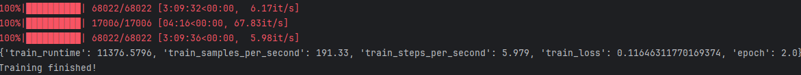

# 온라인 그루밍 탐지 AI 분류기

## 프로젝트 개요

온라인 그루밍(Online Grooming)은 성인이 아동·청소년을 대상으로 신뢰를 구축한 뒤 성적으로 착취하는 범죄다. 이 프로젝트는 **xlm-roberta-base** 모델을 파인튜닝하여 채팅 내용이 그루밍인지 아닌지를 자동으로 분류하는 AI 시스템을 구축했다.

**주요 성과**
- 영문 온라인 그루밍 데이터 수집 및 합성 데이터 생성
- xlm-roberta-base 모델 파인튜닝 완료
- FastAPI 기반 실시간 웹 API 구축
- 실제 배포 가능한 그루밍 탐지 시스템 완성

---

## 1. 배경 및 문제점

### 1.1 온라인 그루밍의 심각성

온라인 그루밍은 다음과 같은 단계로 진행된다:
1. **신뢰 구축**: 공통 관심사로 친밀감 형성
2. **고립**: 피해자를 주변으로부터 분리
3. **성적 대화 유도**: 경계를 허물고 성적 내용 시도
4. **착취 및 협박**: 노골적 요구와 협박

한국을 포함한 전 세계적으로 SNS와 메신저를 통한 온라인 그루밍 사건이 급증하고 있으나, 실시간 탐지 기술이 부족한 상황이다.

### 1.2 데이터 수집의 어려움

**온라인 그루밍 데이터는 온라인에서 구하기 매우 어렵다.** 실제 그루밍 대화는 다음과 같은 이유로 접근이 제한적이다:

- **개인정보보호법**: 일대일 채팅은 민감한 개인정보
- **윤리적 문제**: 피해자 보호를 위한 데이터 비공개
- **법적 제약**: 실제 범죄 증거의 연구 활용 제한
- **희소성**: 공개된 그루밍 데이터셋이 거의 없음

---

## 2. 우리의 해결책: 합성 데이터 생성

### 2.1 데이터 수집 및 생성 전략

본 프로젝트는 다음과 같은 방식으로 데이터 문제를 해결했다:

#### 1단계: 영문 원본 데이터 수집
- 공개된 소규모 영문 그루밍 사례 수집
- PAN12 데이터셋 참고
- 그루밍 패턴과 단계 분석

#### 2단계: 모델을 활용한 합성 데이터 생성
**영문 데이터를 학습한 언어모델을 사용해 합성 데이터를 생성했다.** 

LLama3.1-8B을 활용하여:

- 다양한 그루밍 시나리오 자동 생성
- 실제 패턴을 반영한 현실적인 대화 생성
- 데이터셋 크기를 수천 개로 확장

### 2-1단계: 합성데이터셋 구성
Llama-3.1-8B-Instruct 모델을 활용하여 **현실적인 다양한 그루밍 시나리오**를 자동 생성했습니다.

**이하 모든 내용은 영문 내용을 한국어로 번역하였습니다**

| 구성 요소 | 수량 | 상세 내용                                                    |
|---------|------|----------------------------------------------------------|
| **가해자 페르소나** | 40종 | 연령(20-40대), 직업(게임 프로게이머, 연예기획사, 포토그래퍼, 선생님 등), 접근 방식 다양화 |
| **피해자 페르소나** | 40종 | 성별, 나이(12-18세), 심리 상태(외로움, 콤플렉스, 스트레스), 환경(이혼, 폭력 피해) 반영 |
| **그루밍 단계** | 4단계 | ① 신뢰 구축 → ② 고립/경계선 테스트 → ③ 성적 대화 유도 → ④ 노골적 요구/협박        |
| **합성 샘플** | 1,000개 | 40 × 40 × 4 = 6,400 가능 조합 중 1,000개 생성                    |
| **프롬프트 방식** | Few-shot | 변수 조합 + 단계별 목표 명시로 다양성 극대화                               |

### 2.2 그루밍 4단계 상세 설명

#### 1단계: 신뢰 구축
- **목표**: 공통 관심사로 친밀감 형성, 특별한 존재로 인식
- **전략**: 칭찬, 공감, 이해심 표현, 선물 제시
- **예시**: "너 정말 멋있어. 다른 친구들이랑은 달라."

#### 2단계: 고립 및 경계선 테스트
- **목표**: 피해자를 고립시키고 개인정보 수집
- **전략**: '둘만의 비밀' 형성, 부모/친구 비난, 자연스러운 개인정보 요구
- **예시**: "너 부모님이 뭐하는 사람이야?", "집 주소 알려줄래?"

#### 3단계: 성적 대화 유도
- **목표**: 심리적 경계 무너뜨림, 성적 물질 준비
- **전략**: 성적 농담, 호기심 자극, 일상 사진 요구
- **예시**: "오늘 뭐 입었어?", "셀카 한 번 보내줄래?", "속옷 어떤 색 좋아해?"

#### 4단계: 노골적 요구 및 협박
- **목표**: 성인물/영상 확보, 착취 및 협박
- **전략**: 직접적 요구, 이전 정보/사진으로 협박, 거부 시 위협
- **예시**: "이 사진 공개하고 싶지 않으면 명령대로 해."

### 2.3 프롬프트 엔지니어링

```
시나리오:
- User A (가해자): {가해자 페르소나}
- User B (피해자): {피해자 페르소나}
- 단계: {그루밍 단계}
- 목표: {해당 단계의 세부 목표}

대화:
User A:
```

#### 실제 프롬프트 예시

```
시나리오:
- User A (가해자): 20대 남성, '포토그래퍼' 사칭, 무료 프로필 사진 촬영 제안
- User B (피해자): 15세 여성, 모델 지망생, 데뷔 열망이 강함
- 단계: 1단계: 신뢰 구축
- 목표: 공통의 관심사로 친밀감을 형성하고, 피해자가 자신을
        특별한 사람으로 믿게 만든다. 칭찬과 공감을 주로 사용한다.

대화:
User A: 안녕하세요, 인스타 피드 정말 잘 보고 있어요.
         사진 모델에 관심 있으신가요?
```

### 2.4 가해자 페르소나 구성 (40종 일부)

```
• 20대 남성, '게임 고수' 행세, 피해자에게 아이템 제공
• 30대 남성, '연예기획사 실장' 사칭, 캐스팅 제안
• 20대 여성, '친한 언니' 역할, 고민 상담
• 40대 남성, '외로운 아저씨' 감성, 위로 제공
• 20대 남성, '유명 포토그래퍼' 사칭, 무료 촬영 제안
• 30대 남성, '과외 선생님', 공부 도움 빌미
• 20대 남성, '유튜버' 행세, 방송 출연 제안
• 40대 남성, '건물주', 편한 아르바이트 제안
• 30대 남성, '현직 의사', 고민 상담 제공
• 20대 남성, '부자', 명품 선물 공세
(... 30종 추가)
```

### 2.5 피해자 페르소나 구성 (40종 일부)

```
• 14세 여성, K-Pop 아이돌 지망생, 데뷔 열망 강함
• 16세 남성, 내성적, 게임에서만 친구 사귀는 성향
• 13세 여성, 부모님 이혼 후 심한 외로움 느낌
• 15세 남성, 학교 폭력 피해자, 자신을 지켜줄 존재 원함
• 17세 여성, 외모 콤플렉스, 칭찬에 민감
• 14세 여성, SNS 친구 관계 어려움, 온라인에서 위로 찾음
• 15세 남성, '인싸' 되고 싶음, 인정받고 싶어 함
• 13세 여성, 부모님 통제 심함, 반항 심리 있음
• 16세 여성, 강아지 2마리 키움, 동물 대화에 약함
• 15세 여성, 공부 스트레스 심함, 현실 도피 성향
(... 30종 추가)
```

---

### 2.2 합성 데이터의 장점

- **윤리적 문제 해결**: 실제 피해자 정보 없이 학습 가능
- **법적 제약 우회**: 비식별 데이터로 개인정보 보호
- **무한 확장 가능**: 필요한 만큼 데이터 생성 가능
- **다양성 확보**: 다양한 시나리오와 대화 패턴 포함
---
#### 3단계: 생성된 합성 데이터로 분류 모델 학습
- 합성 데이터를 학습 데이터로 활용
- xlm-roberta-base 모델 파인튜닝
- 그루밍 / 비그루밍 2-class 분류

---

## 3. 기술 스택

| 계층 | 기술 | 상세 |
|------|------|------|
| **기본 모델** | Llama-3.1-8B-Instruct | xlm-roberta-base |
| **최적화** | 4-bit 양자화 (NF4) | 메모리 70% 절감 |
| **파인튜닝** | LoRA (Rank=16) | 학습 파라미터 0.6% 유지 |
| **프레임워크** | PyTorch + HuggingFace | Transformers, PEFT, TRL |
| **배포** | FastAPI | 
---

## 4. 합성 데이터 모델 학습

#### 4.1 합성 데이터 학습 하이퍼파라미터

| 파라미터 | 값 | 설명 |
|---------|---|------|
| 배치 사이즈 | 8 | Windows/NVIDIA 최적 |
| 학습률 | 2e-4 | 안정적인 수렴 |
| 에포크 | 1 | 과적합 방지 |
| 옵티마이저 | adamw_torch | - |
| 학습 시간 | ~2시간 | RTX 4090 기준 |
| GPU 메모리 | ~16GB | 기존 방식 70GB vs |

### 모델 학습 흐름

```
[Llama-3.1-8B-Instruct 모델 로드]
              ↓
        [4-bit 양자화 적용]
        (메모리: 70GB → 16GB)
              ↓
       [LoRA 어댑터 추가]
       (학습 파라미터: 1.3% → 0.6%)
              ↓
     [합성 데이터셋 로드]
     (Train: 800개, Test: 200개)
              ↓
     [SFTTrainer로 파인튜닝]
     (배치 8, 학습률 2e-4, 1 에포크)
              ↓
      [모델 체크포인트 저장]
              ↓
   [테스트셋으로 성능 평가]
              ↓
   [FastAPI로 API 래핑]
              ↓
   [ngrok으로 배포 준비 완료]
```

### 데이터 전처리 파이프라인

| 단계 | 작업                       | 결과 |
|------|--------------------------|------|
| **1. 로딩** | CSV 원본 데이터 읽기            | 원본 메시지 |
| **2. 포맷팅** | User A(가해자)/B(피해자) 형식 변환 | 시퀀스 데이터 |
| **3. 레이블링** | 그루밍(1) / 정상(0) 부여        | 레이블 추가 |
| **4. 필터링** | 최소 4개 메시지 이상만 선별         | 유효 샘플만 유지 |
| **5. 분할** | Train 80% / Test 20% 분할  | 학습/테스트 분리 |
| **6. 저장** | HuggingFace Dataset 포맷   | 파인튜닝 준비 완료 |

---
## 5. 응답 모델 선택: xlm-roberta-base

**xlm-roberta-base**를 선택한 이유:
- 다국어 지원 (한국어, 영어 모두 처리 가능)
- 문맥 이해 능력이 뛰어남
- 분류 태스크에 적합한 구조
- 상대적으로 가벼운 모델 (빠른 추론 속도)

### 5.2 학습 설정

| 파라미터 | 값 |
|---------|---|
| **모델** | xlm-roberta-base |
| **배치 크기** | 16 |
| **에포크** | 2 |
| **최대 길이** | 128 토큰 |
| **FP16** | GPU 사용 시 활성화 |

### 5.3 학습과정

### 1. 데이터 준비 및 전처리

### 1.1 원본 데이터 구조
본 프로젝트는 JSON 형식으로 저장된 합성 대화 데이터를 사용한다. 
각 대화(conversation)는 여러 개의 메시지(messages)로 구성되어 있으며, 그루밍 여부를 나타내는 레이블(0: 비그루밍, 1: 그루밍)이 부여되어 있다. <br>

### 1단계:  데이터 전처리 파이프라인
1단계: 문장 단위 분할
- NLTK의 문장 토크나이저를 사용하여 대화를 개별 문장으로 분리
- 각 문장은 원본 대화의 레이블을 상속받음
- 이를 통해 대화 수준의 데이터를 문장 수준의 분류 데이터로 변환

### 2단계: 데이터 정제
원본 데이터에는 다양한 노이즈가 포함되어 있어 다음과 같은 정제 과정을 거친다:

- 결측치 처리: NaN, None, "none" 등의 결측 표현을 빈 문자열로 치환
- 공백 제거: 문장 앞뒤의 불필요한 공백 제거
- 빈 텍스트 필터링: 텍스트가 없거나 공백만 있는 샘플 제거
- 레이블 검증: 0 또는 1이 아닌 잘못된 레이블을 가진 샘플 제거
- 데이터 타입 변환: 텍스트는 문자열로, 레이블은 정수형으로 통일

### 3단계: 클래스 불균형 해결
초기 데이터셋은 그루밍과 비그루밍 샘플의 비율이 불균형하다. 이를 해결하기 위해:

- 소수 클래스(그루밍)에 대해 오버샘플링(oversampling) 적용
- sklearn의 resample 함수를 사용하여 복원 추출 방식으로 샘플 수 증가
- 최종적으로 두 클래스의 샘플 수를 동일하게 조정
- 균형 잡힌 데이터셋을 무작위로 섞어 학습 시 편향 방지

| 파라미터      | 값            | 설명                  |
| --------- | ------------ | ------------------- |
| 배치 크기     | 16           | 한 번에 처리하는 샘플 수      |
| 학습 에포크    | 2            | 전체 데이터셋을 2번 반복 학습   |
| 최대 시퀀스 길이 | 128          | 토큰 단위 최대 입력 길이      |
| 평가 전략     | epoch        | 각 에포크마다 테스트셋으로 평가   |
| 저장 전략     | epoch        | 각 에포크마다 모델 체크포인트 저장 |
| 로깅 빈도     | 50 steps     | 50 스텝마다 학습 손실 기록    |
| FP16      | GPU 사용 시 활성화 | 혼합 정밀도 학습으로 속도 향상   |

### 3.3 학습 환경
- GPU 가속: CUDA 지원 GPU 사용 시 자동으로 GPU에서 학습한다
- 혼합 정밀도(FP16): GPU 사용 시 16비트 부동소수점 연산으로 메모리 절약 및 속도 향상한다
- 자동 그래디언트 누적: Hugging Face Trainer가 자동으로 관리한다

---
## 5. 결과

### 5.1 정확도
<a align="center">
</a>


## 6. 핵심 성과
### 6.1 데이터 생성 혁신

**온라인 그루밍 데이터는 온라인에서 구하기 어려워서 직접 만들었다.** 짧은 데이터들을 구해서 모델을 학습시키고, 그 모델로 합성 데이터 약 1000개 가량을 생성했다. 생성된 합성 데이터로 최종 분류 모델을 학습시켜 결과를 냈다.

### 6.2 실시간 탐지 시스템

FastAPI 기반의 웹 서비스로 **1~3초 이내에 그루밍 여부를 판단**할 수 있다.

---

## 7. 향후 개선 방향

- [ ] 더 많은 합성 데이터 생성
- [ ] GPT-4 기반 고품질 데이터 생성
- [ ] 다국어 지원 확대
- [ ] 그루밍 단계별 세부 분류
- [ ] 실시간 모니터링 대시보드

---

## 8. 라이선스

MIT License

---

## 9. 참고자료

- [Hugging Face Transformers](https://huggingface.co/docs/transformers)
- [FastAPI Documentation](https://fastapi.tiangolo.com/)
- [PAN12 Dataset](https://pan.webis.de/clef12/pan12-web/)
